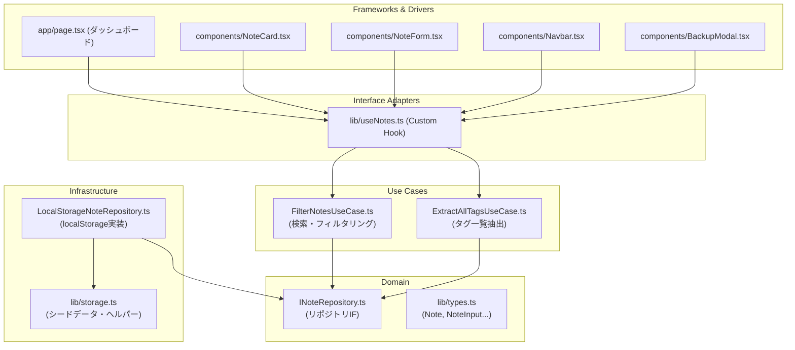
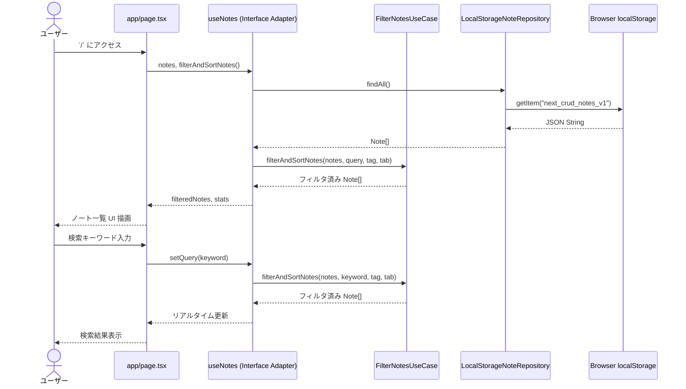

# PulseNote - App Router & LocalStorage CRUD ノートアプリ

`localStorage` をデータベース代わりに利用した、Next.js 16 App Router 構成のモダンなマルチページ CRUD ノートアプリケーションです。  
**Clean Architecture** に基づいて設計されており、高いテスト容易性と保守性を実現しています。

---

## 🚀 実装した主なコンポーネント・機能

### 1. マルチページ App Router 構造 (ページルーティング)

- **` / ` (ダッシュボード & ノート一覧)**
  - ノート総数・ピン留め数・お気に入り数のリアルタイム統計表示
  - タイトルおよび本文のリアルタイムキーワード検索
  - タグ別の絞り込みフィルタリング（全タグ切り替え対応）
  - 表示モード切替：**グリッド表示 (Grid)** / **リスト表示 (List)**
  - ピン留めされたノートの最上部優先表示セクション
  - フィルタータブ：**すべて / ピン留め / お気に入り** の3段階切替
- **`/notes/new` (新規ノート作成)**
  - タイトル、マークダウン本文、タグ（追加・削除）、カテゴリカラーアクセント（6色）
  - ピン留め・お気に入り初期指定
  - エディタ表示モード：「編集」「プレビュー」「分割 (Split)」
  - 作成完了後、詳細画面 `/notes/[id]` へ自動リダイレクト
- **`/notes/[id]` (ノート詳細閲覧)**
  - マークダウンテキストの整形描画（見出し、箇条書き、コードブロック、引用、チェックボックス）
  - メタ情報パネル（最終更新日時、読了目安時間、文字数・単語数カウンター）
  - 単体ノートの Markdown (`.md`) ダウンロード機能
  - 編集画面・削除アクション
- **`/notes/[id]/edit` (ノート編集)**
  - 既存ノート情報の自動読み込みとリアルタイム更新
  - 更新後の詳細画面へのリダイレクト

---

### 2. クリーンアーキテクチャ構成

本アプリは **Clean Architecture** に基づいて設計されています。依存性の方向は常に「外側 → 内側」を厳守しています。

```
Frameworks & Drivers (Next.js Pages / React Components)
        ↓
Interface Adapters (Custom Hook: useNotes.ts)
        ↓
Application / Use Cases (domain/ UseCases)
        ↓
Domain / Entities (types.ts + INoteRepository.ts)
        ↑
Infrastructure (LocalStorageNoteRepository.ts)
```

#### 🏛️ 各層の役割と実装ファイル

| 層 | 役割 | ファイル |
|---|---|---|
| **Domain** | ビジネスルールの定義（外部依存なし） | `lib/domain/INoteRepository.ts`, `lib/types.ts` |
| **Use Cases** | アプリケーション固有のロジック | `lib/domain/FilterNotesUseCase.ts`, `lib/domain/ExtractAllTagsUseCase.ts` |
| **Infrastructure** | 外部ストレージへの具体的な実装 | `lib/infrastructure/LocalStorageNoteRepository.ts`, `lib/storage.ts` |
| **Interface Adapters** | React向けのカスタムフック（UseCase呼び出し） | `lib/useNotes.ts` |
| **Frameworks & Drivers** | Next.js ページ・UIコンポーネント | `app/`, `components/` |

#### 📐 アーキテクチャ図



---

### 3. データ永続化・コンポーネント設計

- **`localStorage` データベース層 ([`my-app/lib/storage.ts`](file:///c:/works/Antigravity_Github/my-app/lib/storage.ts))**
  - ブラウザの `localStorage` に `next_crud_notes_v1` キーで永続化。
  - 初回アクセス時に自動投入されるサンプルノート3件（シードデータ）。
- **リポジトリパターン ([`my-app/lib/domain/INoteRepository.ts`](file:///c:/works/Antigravity_Github/my-app/lib/domain/INoteRepository.ts))**
  - インターフェース定義により、Infrastructure実装を差し替え可能な設計。
  - メソッド: `findAll()`, `findById()`, `save()`, `update()`, `delete()`, `togglePin()`, `toggleFavorite()`, `importAll()`, `resetToDefault()`
- **SSR Hydration 防護 ([`my-app/lib/useNotes.ts`](file:///c:/works/Antigravity_Github/my-app/lib/useNotes.ts))**
  - Next.js SSR レンダリング時とクライアント初期化時のハイドレーションエラーを完全回避。
  - 別タブ間での `storage` イベント連動同期。
- **データ管理 & バックアップ ([`my-app/components/BackupModal.tsx`](file:///c:/works/Antigravity_Github/my-app/components/BackupModal.tsx))**
  - 全ノートデータを一括で JSON ファイルとしてエクスポート（ダウンロード）。
  - JSON ファイルからの全データ復元（インポート）。
  - 初期サンプルデータへのワンクリックリセット機能。
- **モダンデザイン ([`my-app/components/Navbar.tsx`](file:///c:/works/Antigravity_Github/my-app/components/Navbar.tsx), [`my-app/app/globals.css`](file:///c:/works/Antigravity_Github/my-app/app/globals.css))**
  - すりガラス風透過エフェクト（グラスモフィズム `backdrop-blur`）
  - ダークモード / ライトモードの手動切替トグル（システム設定自動検出付き）
  - Lucide React アイコン群による洗練された操作インターフェース

---

## 🛠️ 動作確認・ローカル起動方法

### 前提条件
- Node.js 18.x 以上
- npm / yarn / pnpm

### 1. 依存パッケージのインストール
```bash
cd my-app
npm install
```

### 2. 開発サーバーの起動
```bash
npm run dev
```
起動後、ブラウザで [http://localhost:3000](http://localhost:3000) にアクセスしてください。

### 3. プロダクションビルド検証
TypeScript 型チェックおよび Next.js App Router ビルドの正常性を確認する場合：
```bash
npm run build
```

### 4. テスト実行
```bash
npm test
```

---

## 📁 ディレクトリ構造

```text
c:\works\Antigravity_Github/
├── requirement.md          # 要件定義書 (PRD)
├── README.md               # アプリ概要・機能・起動マニュアル
└── my-app/                 # Next.js App Router アプリケーション本体
    ├── app/
    │   ├── globals.css         # グラスモフィズム、テーマ変数、カスタムスタイル
    │   ├── layout.tsx          # 共通レイアウト (Navbar, 背景グラデーション, フッター)
    │   └── page.tsx            # [/] ダッシュボード・一覧ページ
    ├── components/
    │   ├── Navbar.tsx          # ナビゲーションバー (ヘッダー, テーマ切替, バックアップ)
    │   ├── NoteCard.tsx        # ノートカード (Grid/List両対応)
    │   ├── NoteForm.tsx        # ノート入力フォーム (編集/プレビュー/分割)
    │   ├── MarkdownViewer.tsx  # マークダウン整形レンダラー
    │   └── BackupModal.tsx     # JSONデータバックアップ・復元モーダル
    ├── lib/
    │   ├── types.ts            # 型定義 (Note, NoteInput, CategoryColor, FilterTab, ViewMode等)
    │   ├── storage.ts          # localStorage操作・シードデータ・JSONヘルパー
    │   ├── useNotes.ts         # ノート管理用カスタムReact Hook (Interface Adapter層)
    │   ├── domain/             # ドメイン層 (外部依存なし・純粋ロジック)
    │   │   ├── INoteRepository.ts      # リポジトリインターフェース
    │   │   ├── FilterNotesUseCase.ts   # 検索・フィルタリング・ソートユースケース
    │   │   └── ExtractAllTagsUseCase.ts # タグ一覧抽出ユースケース
    │   └── infrastructure/     # インフラ層 (外部ストレージ実装)
    │       └── LocalStorageNoteRepository.ts # INoteRepositoryのlocalStorage実装
    ├── __tests__/              # テストディレクトリ (Jest)
    └── package.json
```

---

## 🗂️ データモデル

```typescript
// lib/types.ts

export type CategoryColor = 'indigo' | 'emerald' | 'rose' | 'amber' | 'purple' | 'cyan';

export interface Note {
  id: string;          // UUID v4
  title: string;       // タイトル
  content: string;     // マークダウン形式の本文
  tags: string[];      // タグ配列 (例: ["Work", "Idea"])
  categoryColor: CategoryColor; // アクセントカラー
  isPinned: boolean;   // ピン留めフラグ
  isFavorite: boolean; // お気に入りフラグ
  createdAt: string;   // ISO 8601 文字列
  updatedAt: string;   // ISO 8601 文字列
}

export type NoteInput = Omit<Note, 'id' | 'createdAt' | 'updatedAt'>;
export type ViewMode  = 'grid' | 'list';
export type FilterTab = 'all' | 'pinned' | 'favorites';
```

### リポジトリインターフェース

```typescript
// lib/domain/INoteRepository.ts

export interface INoteRepository {
  findAll(): Note[];
  findById(id: string): Note | undefined;
  findByQueryAndTag(query: string, tag: string | null): Note[];
  save(noteInput: NoteInput): Note;
  update(id: string, noteInput: Partial<NoteInput>): Note | null;
  delete(id: string): boolean;
  togglePin(id: string): void;
  toggleFavorite(id: string): void;
  importAll(jsonStr: string): boolean;
  resetToDefault(): void;
}
```

---

## 🔄 アプリケーションフロー



---

## ⚠️ エッジケース・異常系

| ケース | 期待する挙動 | エラー/状態ハンドリング |
| :--- | :--- | :--- |
| `localStorage`が空の初アクセス | サンプルノート（3件）を自動投入し即座に表示 | Hydrationエラーを防ぎスムーズに初期化 |
| 存在しない`id`へのアクセス (`/notes/invalid-id`) | 「ノートが見つかりません」画面を表示し一覧への導線を提示 | 画面クラッシュを防止し一覧戻りボタン表示 |
| `localStorage`の容量超過 | 「ブラウザの保存容量上限に達しました」という通知アラート | `QuotaExceededError`をcatchしてUIに警告 |
| シークレットモード/ストレージ無効 | メモリ内でのテンポラリ保持にフォールバック＋警告表示 | `try-catch`での安全判定 |

---

## 🛡️ 技術スタック

| 分類 | 技術 |
|------|------|
| Framework | Next.js 16 (App Router) |
| Library | React 19, TypeScript |
| Styling | Tailwind CSS v4 |
| Icons | Lucide React |
| Storage | Browser `localStorage` API |
| Testing | Jest + React Testing Library |
| Architecture | Clean Architecture |
