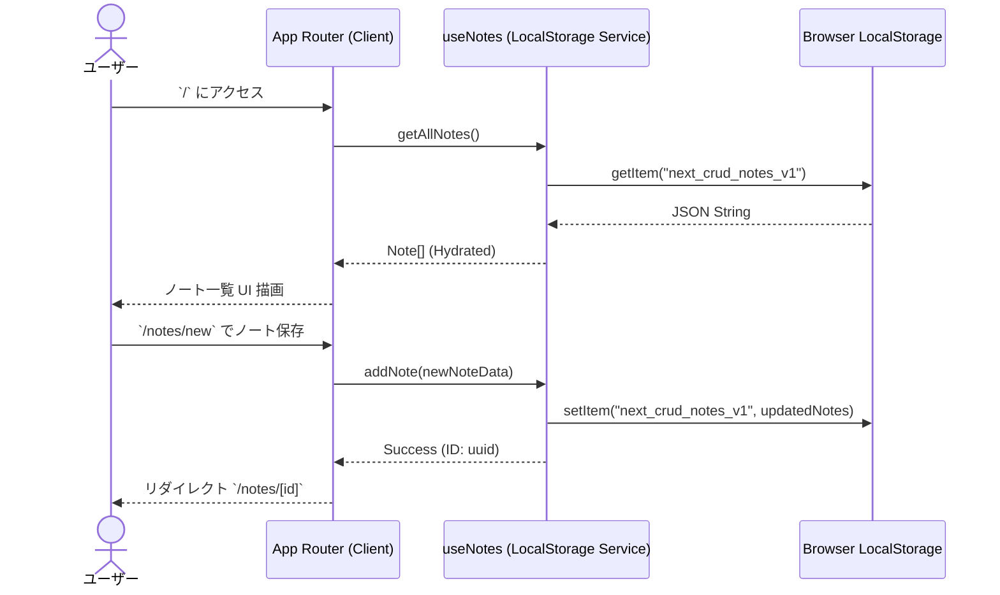

# 要件定義書: localStorageベース App Router マルチページCRUDノートアプリ

## 1. 概要 (Overview)

- **背景と課題**: デバイスローカルで軽快に動作し、サーバーや認証登録を不要としたプライベートなメモ・ノート管理環境のニーズが存在する。従来の単一ページアプリ（SPA）ではURL共有やブラウザ履歴によるページ移動がしづらく、コンテンツ閲覧と編集のコンテキスト分離が曖昧になりがちであった。
- **目的**: Next.js App Routerのマルチページ構造を活用し、`localStorage`をデータベースとして使用する、高速・安全かつモダンなデザインのCRUDノートアプリケーションを一括構築する。
- **ターゲット**: 個人でタスク、アイディア、ドキュメントを手軽に整理・管理したいユーザー（PC/スマートフォン全対応）。

---

## 2. スコープ (Scope)

- **In-Scope**:
  - **マルチページ遷移構造 (App Router)**:
    - `/` : ノート一覧・ダッシュボード（検索、タグフィルター、ビュー切替、ピン留め・お気に入り一覧）
    - `/notes/new` : ノート新規作成ページ（ライブプレビュー、タグ選択、アクセントカラー、自動保存）
    - `/notes/[id]` : ノート詳細閲覧ページ（マークダウンレンダリング、エクスポート機能、メタ情報表示）
    - `/notes/[id]/edit` : ノート編集ページ（既存データの読み込み、変更履歴保存、削除）
  - **データ保存 (localStorage)**:
    - CRUD（Create, Read, Update, Delete）完全対応
    - ピン留め (Pin) / お気に入り (Favorite) トグル
    - データのJSONエクスポート・インポートバックアップ機能
    - 初回訪問時のサンプルノート自動生成（シードデータ）
  - **モダンUI & UX**:
    - グラスモフィズムデザイン、ダークモード/ライトモード切替
    - タグによるマルチフィルターとリアルタイムキーワード検索
    - Next.js SSR/Client Hydrationミスマッチ防護（安全なClient Componentフック構造）
- **Out-of-Scope**:
  - 外部データベース（PostgreSQL/MongoDB等）やサーバーサイド永続化（今回は完全クライアントサイド`localStorage`）
  - 複数ユーザーアカウント認証・ログイン機能
  - クラウドリアルタイム同期（Firebase/WebSockets）

---

## 3. 確認事項・不明点 (Clarifying Questions)

- [x] **ストレージ**: ブラウザの`localStorage`を使用（上限約5MB）。
- [x] **ルーター**: Next.js App Router (`app/` ディレクトリ構造) を使用。
- [x] **スタイリング**: Tailwind CSS v4 + モダンカスタムデザインシステム。

---

## 4. 機能要件 (Functional Requirements)

### 4.1 機能一覧 (Feature List)

- **[FR-01] ノート一覧・検索・フィルタリング (`/`)**:
  - キーワード（タイトル・本文）によるリアルタイム検索。
  - タグ別の絞り込みフィルタリング。
  - ピン留めされたノートの優先表示セクション。
  - カード表示 (Grid) / リスト表示 (List) の切り替え機能。
- **[FR-02] ノート詳細閲覧 (`/notes/[id]`)**:
  - Markdown記述の整形表示（見出し、箇条書き、コードブロック、引用など）。
  - 作成日時・更新日時・文字数・推定読了時間の表示。
  - 単体ノートのMarkdown (.md) および JSON形式でのエクスポート。
- **[FR-03] ノート作成 (`/notes/new`)**:
  - タイトル、本文、タグ、カラーテーマの入力。
  - エディタとリアルタイムマークダウンプレビューの切り替え/分割。
- **[FR-04] ノート編集・更新 (`/notes/[id]/edit`)**:
  - 既存ノート情報の入力フォームへの反映と更新保存。
  - 変更破棄時の確認ダイアログ。
- **[FR-05] ノート削除**:
  - ノート詳細または一覧からの物理削除（確認モーダル付き）。
- **[FR-06] データバックアップ＆初期化**:
  - 全ノートデータのJSON出力およびJSONファイルからの復元機能。

### 4.2 アプリケーションフロー (Sequence Diagram)



### 4.3 エッジケース・異常系

| ケース | 期待する挙動 | エラー/状態ハンドリング |
| :--- | :--- | :--- |
| `localStorage`が空の初アクセス | サンプルノート（3件）を自動投入し即座に表示 | Hydrationエラーを防ぎスムーズに初期化 |
| 存在しない`id`へのアクセス (`/notes/invalid-id`) | 404風の「ノートが見つかりません」画面を表示し一覧への導線を提示 | 画面クラッシュを防止し一覧戻りボタン表示 |
| `localStorage`の容量超過 | 「ブラウザの保存容量上限に達しました」という通知アラート | `QuotaExceededError`をcatchしてUIに警告 |
| シークレットモード/ストレージ無効 | メモリ内でのテンポラリ保持にフォールバック＋警告表示 | `try-catch`での安全判定 |

---

## 5. 非機能要件 (Non-Functional Requirements)

### 5.1 UX & デザイン (Design Excellence)
- **テーマ**: ダークモード / ライトモード対応（システム設定連動および手動トグル）。
- **ビジュアル**: グラスモフィズム（透過背景・ぼかし効果）、滑らかなホバーアニメーション、モダンなカラーパレット（Violet / Indigo / Cyan）。
- **レスポンシブ**: スマートフォン(375px〜)、タブレット、デスクトップすべての画面幅に対応。

### 5.2 パフォーマンス & 堅牢性
- **Hydrationの安定性**: SSRレンダリング時とクライアント再描画時でのミスマッチ（React Hydration Mismatch Error）を完璧に回避する構造。
- **高速化**: ページ切り替えはApp Routerの高速クライアント遷移を利用。

---

## 6. データモデル (Data Model)

```typescript
export interface Note {
  id: string;          // UUID v4
  title: string;       // タイトル
  content: string;     // マークダウン形式の本文
  tags: string[];      // タグ配列 (例: ["Work", "Idea"])
  categoryColor?: string; // アクセントカラー (indigo, emerald, rose, amber, purple)
  isPinned: boolean;   // ピン留めフラグ
  isFavorite: boolean; // お気に入りフラグ
  createdAt: string;   // ISO 8601 文字列
  updatedAt: string;   // ISO 8601 文字列
}

export type ViewMode = 'grid' | 'list';
export type ThemeMode = 'dark' | 'light' | 'system';
```

---

## 7. 技術スタック (Tech Stack)

- **Framework**: Next.js 16 (App Router)
- **Library**: React 19, TypeScript
- **Styling**: Tailwind CSS v4
- **Icons**: Lucide React
- **Storage**: Browser `localStorage` API

---

## 8. リスクと対策 (Risks & Mitigation)

- **リスク1: SSRでの`localStorage`非互換エラー (`window is not defined`)**
  - *対策*: データ取得および書き込み処理をカスタムHook `useNotes` 内に隠蔽し、`useEffect` や `mounted` フラグでクライアント専用処理にする。
- **リスク2: ブラウザ間のデータ共有不可**
  - *対策*: データ管理画面にてワンクリックでJSONとしてエクスポート/インポートできる機能を標準搭載。
